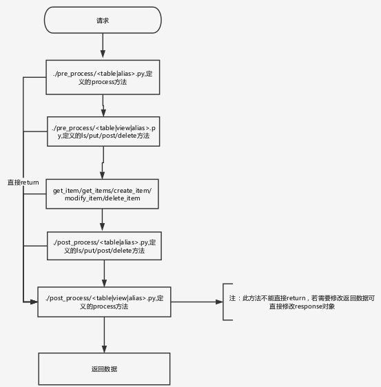

# 生命周期

    执行的流程：请求-前处理-数据操作-后处理-返回数据

   
#### 请求
    
    ip:端口号/api/v1/接口名（表名）
  
####  前处理pre_process
* 前前处理
    前处理文件（/<table|alias>.py）定义的process方法，此方法在前处理之前执行
* 前处理
    /<table|view|alias>.py定义的ls/put/post/delete方法
        注：视图优先,如果是表名，对其进行处理，tables中是所有的视图，
        先去视图中进行查询，如果不在tables中，返回404
        sync def ls(request, name):
            name = name+'_view' 
        
####  数据操作CRUD（内部接口或外部接口）

* 内部：get_item/get_items/create_item/modify_item/delete_item
* 外部：对应http方法

####  后处理post_process

* 后处理
/<table|alias>.py,定义的ls/put/post/delete方法
        
* 后后处理
 /<table|view|alias>.py,定义的process方法
`注`：上面的四步（前前处理、前处理、CRUD、后处理）都可以直接return到此；此方法不能直接return，若需要修改返回数据可直接修改response对象；始终都会被执行

#### 返回数据
